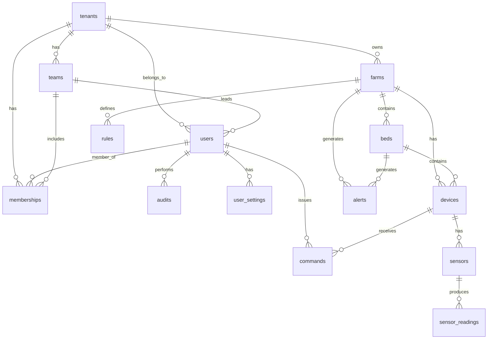

# 🗄️ 실제 Supabase 데이터베이스 구조 (2025.01.01 기준)

## 📋 전체 테이블 목록

### 🔐 인증 관련 테이블 (auth 스키마)
- `auth.users` - Supabase 인증 사용자
- `auth.identities` - 소셜 로그인 연동
- `auth.sessions` - 사용자 세션
- `auth.mfa_factors` - 다단계 인증

### 🏢 비즈니스 로직 테이블 (public 스키마)

| 테이블명 | 용도 | 주요 필드 |
|---------|------|----------|
| `tenants` | 테넌트 관리 | id, name, description |
| `users` | 사용자 정보 | id, email, name, is_approved, is_active |
| `memberships` | 사용자-테넌트 관계 | tenant_id, user_id, role, team_id |
| `teams` | 팀 관리 | tenant_id, name, team_code |
| `farms` | 농장 정보 | tenant_id, name, location |
| `beds` | 베드 정보 | farm_id, name, crop, target_* |
| `devices` | 디바이스/장치 | farm_id, bed_id, type, status, meta |
| `sensors` | 센서 정보 | device_id, type, unit, meta |
| `sensor_readings` | 센서 데이터 | sensor_id, ts, value, quality |
| `alerts` | 알림/경고 | farm_id, bed_id, severity, title |
| `commands` | 제어 명령 | device_id, command, payload, status |
| `rules` | 자동화 규칙 | farm_id, trigger, condition, action |
| `audits` | 감사 로그 | user_id, entity, action, diff |
| `user_settings` | 사용자 설정 | user_id, notification_preferences, telegram_chat_id |

### 🌱 영양액 관련 테이블
| 테이블명 | 용도 | 주요 필드 |
|---------|------|----------|
| `crop_profiles` | 작물 프로필 | crop_key, crop_name, stage, target_* |
| `water_profiles` | 물 프로필 | tenant_id, name, alkalinity, ph |
| `recipes` | 영양액 레시피 | tenant_id, crop_profile_id, target_* |
| `salts` | 염류 정보 | name, formula, ion_contributions |
| `nutrient_ions` | 영양 이온 | symbol, name, valence |
| `acid_bases` | 산/염기 | name, type, normality |

## 🏗️ 핵심 데이터 구조

### 1. 계층 구조
```
테넌트 (tenants)
├── 사용자 (users) → 멤버십 (memberships)
├── 팀 (teams)
└── 농장 (farms)
    └── 베드 (beds)
        └── 디바이스 (devices)
            └── 센서 (sensors)
                └── 센서 데이터 (sensor_readings)
```

### 2. `devices` 테이블 - 핵심 장치 관리
```sql
CREATE TABLE devices (
    id UUID PRIMARY KEY DEFAULT gen_random_uuid(),
    farm_id UUID NOT NULL REFERENCES farms(id),        -- 농장 연결
    bed_id UUID REFERENCES beds(id),                   -- 베드 연결 (선택적)
    type TEXT NOT NULL CHECK (type IN (
        'switch', 'pump', 'fan', 'light', 'motor', 'sensor_gateway'
    )),
    vendor TEXT,                                        -- 'custom', 'tuya'
    tuya_device_id TEXT,                               -- Tuya 디바이스 ID
    status JSONB,                                       -- {"online": true, "on": false}
    meta JSONB,                                        -- {"pi_id": "pi-001", "location": "조1-베드1"}
    created_at TIMESTAMPTZ DEFAULT NOW()
);
```

**디바이스 타입별 용도:**
- `sensor_gateway`: 센서 데이터 수집 게이트웨이
- `light`: LED 조명 제어
- `fan`: 환기팬 제어
- `pump`: 펌프 제어
- `motor`: 모터 제어
- `switch`: 일반 스위치

### 3. `sensors` 테이블 - 센서 정보
```sql
CREATE TABLE sensors (
    id UUID PRIMARY KEY DEFAULT gen_random_uuid(),
    device_id UUID NOT NULL REFERENCES devices(id),
    type TEXT NOT NULL,                                 -- 'temp', 'humidity', 'ec', 'ph', 'lux', 'water_temp'
    unit TEXT,                                         -- '°C', '%', 'mS/cm', 'pH', 'lux'
    meta JSONB,                                        -- {"pin": 2, "sensor_model": "DHT22"}
    created_at TIMESTAMPTZ DEFAULT NOW()
);
```

**센서 타입별 정보:**
- `temp`: 온도 센서 (DHT22) - 단위: °C
- `humidity`: 습도 센서 (DHT22) - 단위: %
- `ec`: 전기전도도 센서 (EC-5) - 단위: mS/cm
- `ph`: pH 센서 (pH-4502C) - 단위: pH
- `lux`: 조도 센서 (BH1750) - 단위: lux
- `water_temp`: 수온 센서 (DS18B20) - 단위: °C

### 4. `sensor_readings` 테이블 - 센서 데이터
```sql
CREATE TABLE sensor_readings (
    id BIGINT PRIMARY KEY DEFAULT nextval('sensor_readings_id_seq'),
    sensor_id UUID NOT NULL REFERENCES sensors(id),
    ts TIMESTAMPTZ NOT NULL,
    value NUMERIC NOT NULL,
    quality INTEGER DEFAULT 1
);
```

### 5. `users` 테이블 - 사용자 정보
```sql
CREATE TABLE users (
    id UUID PRIMARY KEY,
    email TEXT UNIQUE,
    name TEXT,
    company TEXT,                                       -- 소속 (회사명)
    phone TEXT,
    is_approved BOOLEAN DEFAULT false,                 -- 승인 여부
    approved_at TIMESTAMPTZ,
    approved_by UUID REFERENCES users(id),
    is_active BOOLEAN DEFAULT true,                    -- 활성 상태
    role TEXT,                                         -- 역할
    team_name TEXT,
    team_id UUID REFERENCES teams(id),
    tenant_id UUID DEFAULT '00000000-0000-0000-0000-000000000001'::UUID,
    preferred_team TEXT DEFAULT 'admin_assign',
    avatar_url TEXT,
    last_login_at TIMESTAMPTZ,
    created_at TIMESTAMPTZ DEFAULT NOW(),
    updated_at TIMESTAMPTZ DEFAULT NOW()
);
```

### 6. `memberships` 테이블 - 사용자-테넌트 관계
```sql
CREATE TABLE memberships (
    id UUID PRIMARY KEY DEFAULT gen_random_uuid(),
    tenant_id UUID NOT NULL REFERENCES tenants(id),
    user_id UUID NOT NULL REFERENCES users(id),
    role TEXT NOT NULL CHECK (role IN ('owner', 'operator', 'viewer')),
    team_id UUID REFERENCES teams(id)
);
```

**역할별 권한:**
- `owner`: 테넌트 소유자 (모든 권한)
- `operator`: 운영자 (농장 관리 권한)
- `viewer`: 조회자 (읽기 전용)

### 7. `farms` 테이블 - 농장 정보
```sql
CREATE TABLE farms (
    id UUID PRIMARY KEY DEFAULT gen_random_uuid(),
    tenant_id UUID NOT NULL REFERENCES tenants(id),
    name TEXT NOT NULL,
    location TEXT,
    created_at TIMESTAMPTZ DEFAULT NOW()
);
```

### 8. `beds` 테이블 - 베드 정보
```sql
CREATE TABLE beds (
    id UUID PRIMARY KEY DEFAULT gen_random_uuid(),
    farm_id UUID NOT NULL REFERENCES farms(id),
    name TEXT NOT NULL,
    crop TEXT,                                          -- 작물명
    target_temp NUMERIC,                               -- 목표 온도
    target_humidity NUMERIC,                           -- 목표 습도
    target_ec NUMERIC,                                 -- 목표 EC
    target_ph NUMERIC,                                 -- 목표 pH
    created_at TIMESTAMPTZ DEFAULT NOW()
);
```

## 🔗 테이블 관계도



## 📊 현재 데이터 현황

### 실제 데이터베이스 상태 (2025.01.01)
- ✅ **tenants**: 2개 (테스트 팜 등)
- ✅ **farms**: 1개 (메인 팜)
- ✅ **beds**: 6개 (조1-베드1~2, 조2-베드1~2, 조3-베드1~2)
- ✅ **devices**: 7개 (센서게이트웨이 3개 + Tuya 디바이스 4개)
- ✅ **sensors**: 10개 (온도, 습도, EC, pH, 조도, 수온 센서들)
- ✅ **sensor_readings**: 0개 (MQTT 연동 전)
- ✅ **users**: 15개 (승인 대기/승인된 사용자들)
- ✅ **memberships**: 14개 (사용자-테넌트 관계)

## 🎯 주요 기능별 테이블 활용

### 1. 사용자 관리
- `users` + `memberships` + `tenants`: 사용자 인증 및 권한 관리
- `user_settings`: 개인 설정 (텔레그램 ID, 알림 설정 등)

### 2. 농장 관리
- `farms` + `beds`: 농장 및 베드 구조 관리
- `devices`: 농장별 디바이스 배치 및 제어

### 3. 센서 모니터링
- `sensors` + `sensor_readings`: 실시간 센서 데이터 수집
- `alerts`: 임계값 기반 알림 시스템

### 4. 디바이스 제어
- `commands`: 원격 디바이스 제어 명령
- `devices.status`: 실시간 디바이스 상태 관리

### 5. 영양액 관리 (향후 확장)
- `crop_profiles` + `water_profiles` + `recipes`: 영양액 조성 관리
- `salts` + `nutrient_ions`: 영양 성분 데이터베이스

## 🔧 개발 가이드

### 1. 데이터 조회 패턴
```sql
-- 농장별 베드와 디바이스 조회
SELECT f.name as farm_name, b.name as bed_name, d.type as device_type
FROM farms f
LEFT JOIN beds b ON f.id = b.farm_id
LEFT JOIN devices d ON b.id = d.bed_id
WHERE f.tenant_id = $1;

-- 센서별 최신 데이터 조회
SELECT s.type, sr.value, sr.ts
FROM sensors s
LEFT JOIN sensor_readings sr ON s.id = sr.sensor_id
WHERE s.device_id = $1
ORDER BY sr.ts DESC
LIMIT 1;
```

### 2. 권한 체크 패턴
```sql
-- 사용자 권한 확인
SELECT m.role, t.name as tenant_name
FROM memberships m
JOIN tenants t ON m.tenant_id = t.id
WHERE m.user_id = $1;
```

### 3. RLS 정책 고려사항
- 모든 테이블에 Row Level Security 활성화
- 사용자는 자신의 테넌트 데이터만 접근 가능
- 시스템 관리자는 모든 데이터 접근 가능

## ⚠️ 주의사항 및 제약사항

### 1. 데이터 무결성
- `devices.bed_id`는 NULL 허용 (베드에 연결되지 않은 디바이스 가능)
- `sensor_readings`는 BIGINT ID 사용 (대용량 데이터 고려)
- `users.tenant_id`는 기본값 설정됨

### 2. 성능 고려사항
- `sensor_readings` 테이블은 시계열 데이터로 인덱싱 필요
- `devices.status` JSONB 필드는 자주 업데이트됨
- `alerts` 테이블은 실시간 조회 빈도가 높음

### 3. 확장성
- 영양액 관리 테이블들은 향후 확장을 위해 준비됨
- `rules` 테이블로 자동화 규칙 구현 가능
- `audits` 테이블로 모든 사용자 활동 추적 가능

## 🚀 다음 단계

1. **MQTT 연동**: `sensor_readings` 테이블에 실시간 데이터 수집
2. **알림 시스템**: `alerts` 테이블 기반 실시간 알림 구현
3. **자동화 규칙**: `rules` 테이블 기반 자동 제어 시스템
4. **영양액 관리**: 작물별 영양액 레시피 시스템 구축
5. **모바일 앱**: Tuya 디바이스 제어 및 센서 모니터링