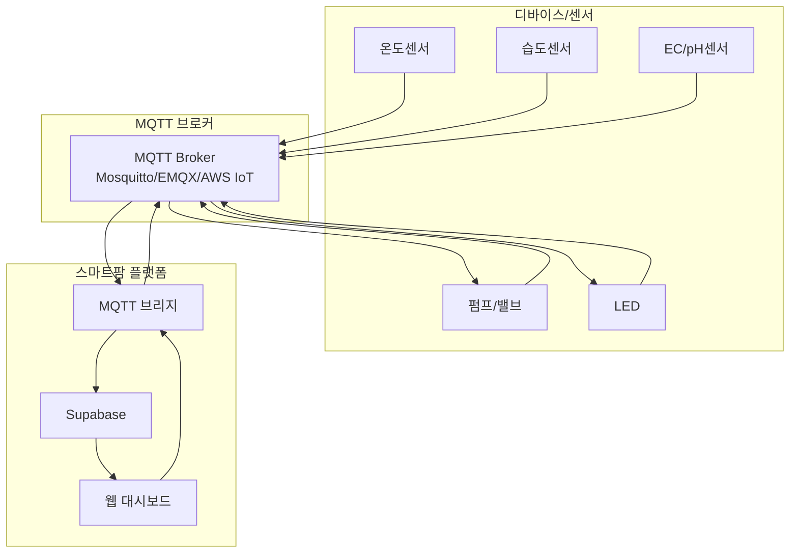

# 🚀 MQTT 연동 종합 가이드

## 📋 개요

이 문서는 스마트팜 플랫폼과 MQTT를 통한 완전한 IoT 시스템 구축을 위한 종합 가이드입니다. 디바이스부터 브로커, 브리지까지 전체 아키텍처를 다룹니다.

## 🏗️ 전체 아키텍처



## 📚 가이드 구성

### 1️⃣ **브로커 설정 가이드**
- [Eclipse Mosquitto 설정](./templates/mosquitto_setup.md) - 오픈소스 브로커
- [EMQX 설정](./templates/emqx_setup.md) - 엔터프라이즈급 브로커
- [AWS IoT Core 설정](./templates/aws_iot_core_setup.md) - 클라우드 서비스

### 2️⃣ **디바이스 연동 템플릿**
- [Arduino/ESP32 템플릿](./templates/arduino_mqtt_template.cpp)
- [Python 템플릿](./templates/python_mqtt_template.py)
- [Node.js 템플릿](./templates/nodejs_mqtt_template.js)

### 3️⃣ **설정 파일**
- [설정 템플릿](./templates/config_template.json)
- [설정 가이드](./templates/README.md)

## 🔄 데이터 흐름

### 센서 데이터 수집 (디바이스 → 서버)
```
디바이스 → MQTT 브로커 → 스마트팜 브리지 → Supabase → 웹 대시보드
```

1. **디바이스**: 센서 데이터를 MQTT 브로커에 발행
2. **브로커**: 메시지 중계 및 영속성 관리
3. **브리지**: 브로커에서 데이터 구독 후 Supabase 저장
4. **대시보드**: 실시간 데이터 표시

### 제어 명령 전송 (서버 → 디바이스)
```
웹 대시보드 → Supabase → 스마트팜 브리지 → MQTT 브로커 → 디바이스
```

1. **대시보드**: 사용자가 제어 명령 입력
2. **브리지**: 명령을 브로커에 발행
3. **브로커**: 디바이스로 명령 전달
4. **디바이스**: 명령 실행 후 ACK 응답

## 📡 토픽 구조

### 표준 토픽 패턴
```
farms/{farm_id}/devices/{device_id}/{message_type}
```

### 메시지 타입
- `registry` - 디바이스 등록 정보
- `state` - 디바이스 상태
- `telemetry` - 센서 데이터
- `command` - 제어 명령
- `command/ack` - 명령 확인 응답

### 예시 토픽
```
farms/farm_001/devices/device_001/telemetry
farms/farm_001/devices/device_001/command
farms/farm_001/devices/device_001/state
```

## 🔐 보안 설정

### 인증 방식
- **사용자명/비밀번호**: 기본 인증
- **클라이언트 인증서**: 고급 보안
- **JWT 토큰**: 세션 기반 인증

### 암호화
- **TLS/SSL**: 전송 계층 암호화
- **MQTT over TLS**: 포트 8883 사용
- **WebSocket Secure**: WSS 지원

### 접근 제어
- **ACL (Access Control List)**: 토픽별 권한 관리
- **정책 기반**: 리소스별 접근 제어
- **역할 기반**: 사용자 역할별 권한

## 🚀 빠른 시작

### 1단계: 브로커 선택 및 설정
```bash
# Mosquitto (추천)
docker run -it -p 1883:1883 -p 8883:8883 eclipse-mosquitto

# EMQX
docker run -d --name emqx -p 1883:1883 -p 8083:8083 emqx/emqx:latest

# AWS IoT Core
# AWS 콘솔에서 설정
```

### 2단계: 디바이스 템플릿 다운로드
```bash
# Python 템플릿 사용
wget https://raw.githubusercontent.com/your-repo/templates/python_mqtt_template.py
pip install paho-mqtt

# 설정 파일 생성
cp config_template.json config.json
# config.json 수정
```

### 3단계: 연결 테스트
```bash
# 디바이스 실행
python python_mqtt_template.py

# 연결 확인
mosquitto_sub -h localhost -t "farms/+/+/telemetry"
```

## 🔧 브로커별 특징

| 브로커 | 장점 | 단점 | 추천 용도 |
|--------|------|------|-----------|
| **Mosquitto** | 경량, 안정적, 무료 | 단일 인스턴스 | 소규모 프로젝트 |
| **EMQX** | 고성능, 클러스터링, 웹 UI | 리소스 사용량 높음 | 대규모 프로젝트 |
| **AWS IoT Core** | 관리형, 확장성, 통합 | 비용, 벤더 락인 | 클라우드 중심 |

## 📊 성능 최적화

### 메시지 최적화
- **배치 전송**: 여러 센서값을 한 번에 전송
- **QoS 설정**: 필요한 경우에만 QoS 1 사용
- **메시지 압축**: gzip 압축 사용

### 연결 최적화
- **영구 연결**: Keep-alive 설정
- **연결 풀링**: 여러 디바이스 간 연결 공유
- **자동 재연결**: 네트워크 장애 시 복구

### 브로커 최적화
- **메모리 관리**: 메시지 큐 크기 조정
- **디스크 I/O**: 영속성 설정 최적화
- **네트워크**: 대역폭 사용량 모니터링

## 🔍 모니터링 및 디버깅

### 로그 설정
```bash
# Mosquitto 로그 레벨
log_type error
log_type warning
log_type notice

# EMQX 로그 설정
log.level = warning
```

### 메트릭 수집
- **연결 수**: 활성 연결 모니터링
- **메시지 처리량**: 초당 메시지 수
- **에러율**: 실패한 메시지 비율
- **응답 시간**: 명령 처리 시간

### 알림 설정
- **연결 장애**: 디바이스 오프라인 알림
- **센서 이상**: 임계값 초과 알림
- **시스템 오류**: 브로커 오류 알림

## 🛠️ 문제 해결

### 일반적인 문제들

#### 1. 연결 실패
```bash
# 포트 확인
netstat -tlnp | grep 1883

# 방화벽 설정
ufw allow 1883
ufw allow 8883
```

#### 2. 인증 실패
```bash
# 사용자 확인
mosquitto_passwd -c passwd username

# ACL 확인
cat acl.conf
```

#### 3. 메시지 전달 실패
```bash
# 토픽 구독 확인
mosquitto_sub -h localhost -t "farms/+/+/telemetry"

# QoS 설정 확인
mosquitto_pub -h localhost -t "test" -m "message" -q 1
```

### 디버깅 도구
- **MQTT Explorer**: GUI 기반 디버깅
- **mosquitto_pub/sub**: 명령줄 테스트
- **Wireshark**: 네트워크 패킷 분석

## 📈 확장성 고려사항

### 수평 확장
- **클러스터링**: 여러 브로커 인스턴스
- **로드 밸런싱**: 연결 분산
- **메시지 라우팅**: 토픽 기반 라우팅

### 수직 확장
- **하드웨어 업그레이드**: CPU, 메모리, 네트워크
- **최적화**: 설정 튜닝
- **캐싱**: 메모리 기반 캐싱

## 🔄 백업 및 복구

### 설정 백업
```bash
# 전체 설정 백업
tar -czf mqtt-backup-$(date +%Y%m%d).tar.gz /etc/mosquitto/
```

### 데이터 백업
```bash
# 메시지 영속성 백업
cp /var/lib/mosquitto/mosquitto.db /backup/
```

### 재해 복구
- **설정 복원**: 백업에서 설정 복원
- **데이터 복원**: 메시지 데이터베이스 복원
- **서비스 재시작**: 브로커 서비스 재시작

## 📚 추가 리소스

### 공식 문서
- [Eclipse Mosquitto](https://mosquitto.org/documentation/)
- [EMQX](https://www.emqx.io/docs/)
- [AWS IoT Core](https://docs.aws.amazon.com/iot/)

### 커뮤니티
- [MQTT.org](https://mqtt.org/)
- [Eclipse IoT](https://iot.eclipse.org/)
- [Stack Overflow](https://stackoverflow.com/questions/tagged/mqtt)

### 도구 및 라이브러리
- [MQTT Explorer](http://mqtt-explorer.com/)
- [Paho MQTT](https://www.eclipse.org/paho/)
- [MQTT.js](https://github.com/mqttjs/MQTT.js)

## 🤝 지원 및 문의

문제가 발생하거나 질문이 있으시면:

1. **로그 확인**: 상세한 오류 로그 분석
2. **설정 검증**: 설정 파일 문법 확인
3. **네트워크 테스트**: 연결 상태 확인
4. **문서 참조**: 관련 가이드 재확인

---

이 종합 가이드를 통해 스마트팜 플랫폼과 완전한 MQTT 기반 IoT 시스템을 구축할 수 있습니다! 🚀
